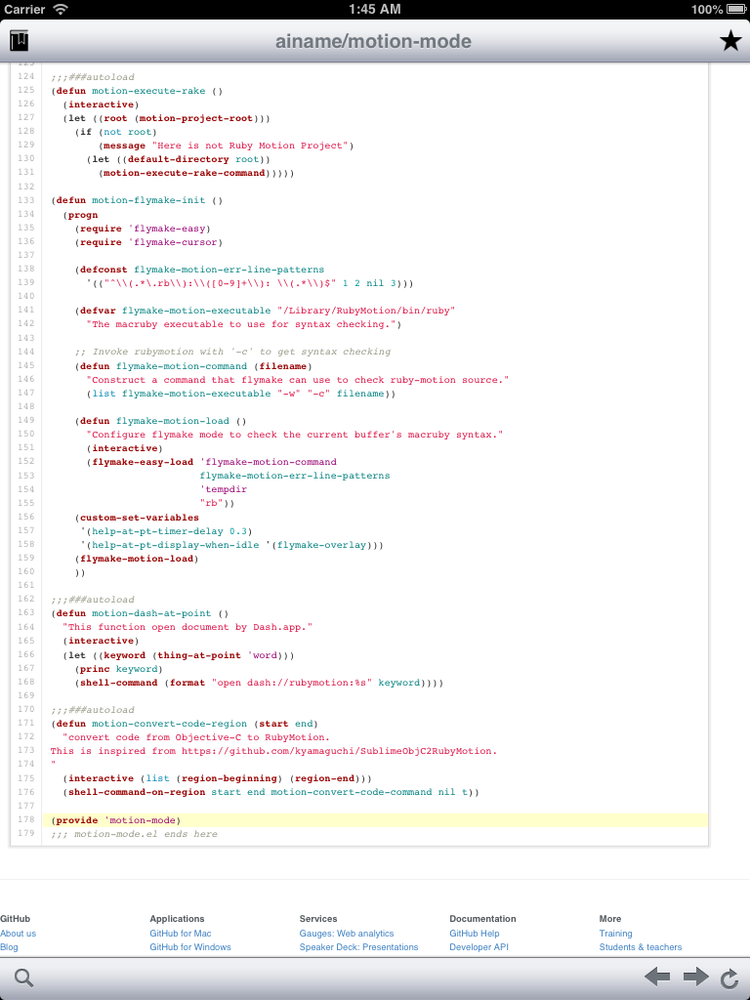
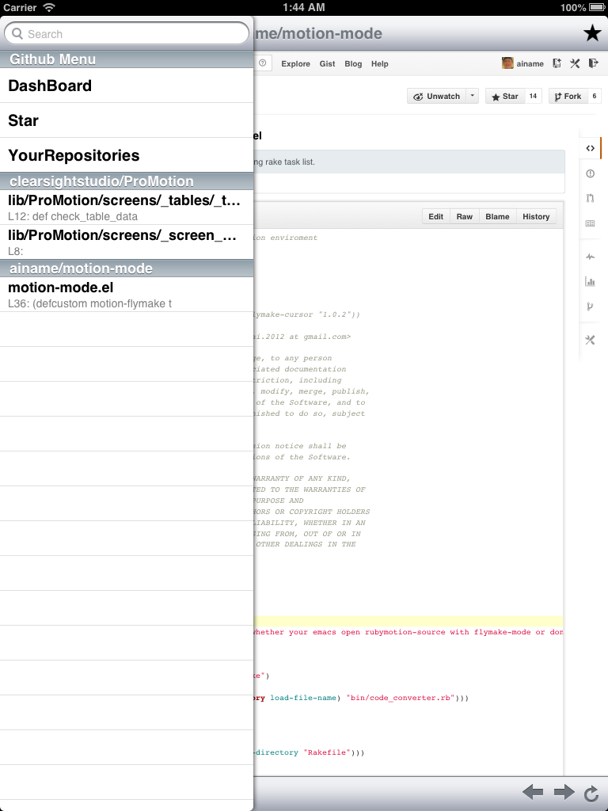
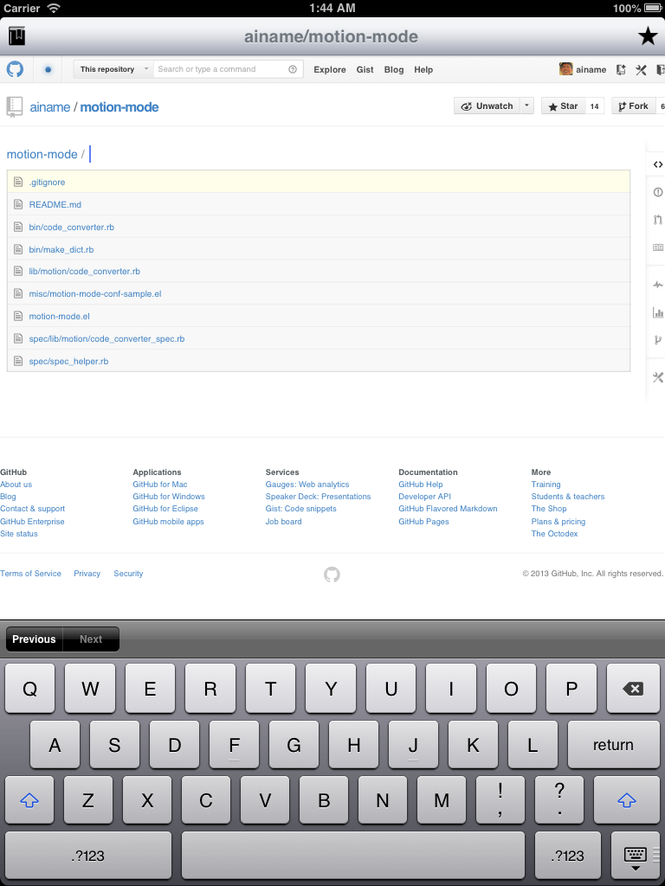

# Shiori
## Features
* manage your bookmarks(it is called shiori in japanese) about line of code at Github.
  * when you tap line number in source code, Shiori add bookmark to list.
* execute file finder on iPad.
  * you can't execute file finder in normal environment, but Shiori provide that.
* some convinience shortcuts
 * star button and some github menu links

## ScreenShots

## Thanks
icons: http://www.iconbeast.com/free/
